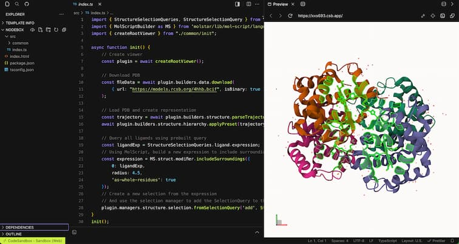
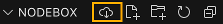

Mol* Example Gallery
====================
This repository serves as a guide to help developers understand and utilize the Mol* code effectively. This gallery aims to provide clear, concise, and practical examples.

## Getting Started
To get started with the Mol* gallery examples, you can try them out in [CodeSandbox](codesandbox.io), run them locally, or use a prebuilt example. 

### CodeSandbox


From a browser, use one of the links below to open a code example in CodeSandbox. This web-application executes the package scripts in a virtual machine to create the application bundle and serve it online, in a preview tab.

The code example can be downloaded as a zip file and executed locally (cf.infra).


You can also sign-in to CodeSandbox and edit the code online using a VS-code interface with code hints and an automatic preview of the changes. Your changes can be saved to your own account.

### Locally
From the terminal, navigate to the root of an example directory (ex: `./default/`). This directory must contain a `package.json` file. Execute the following commands
```sh
# install dependencies
npm install
# run the bundler and start the local development server.
npm run start
```
Once the development server has started and return a local url for the preview.

### Prebuilt
These examples rely on a prebuilt bundle js file that exports the functions required to make the example work. This technique enables standalone HTML pages that can
be run directly from the local file system. The js script content can also be used directly in online editors such as CodePen that can not build bundles.
- See `prebuilt_examples/gallery/example.html` for basic usage
- To expose other functions from Mol*, make changes to the `prebuilt_examples/src` folder, and rebuild the supporting library using
```sh
# install dependencies
npm install
# build the gallery.js file
npm run build
# or watch for development
npm run watch
```
- For usage in CodePen, use https://www.jsdelivr.com for `prebuilt_examples/gallery/js/index.js` with `Add External Script`:
  - https://cdn.jsdelivr.net/gh/molstar/example-gallery/prebuilt_examples/gallery/js/gallery.js
  - [Minimal example](https://codepen.io/dsehnal/pen/rNgyGZm)

## Examples and SandBoxes
- Selections
  - [Ligand with surrounding](https://codesandbox.io/p/sandbox/github/molstar/example-gallery/master/selection/select_ligand_and_surroundings)
- Representation
  - [Create representations](https://codesandbox.io/p/sandbox/github/molstar/example-gallery/master/representation/create_representations)
  - [Set transparency on selection](https://codesandbox.io/p/sandbox/github/molstar/example-gallery/master/representation/transparency_using_selection)
- Coloring
  - [Color a selection](https://codesandbox.io/p/sandbox/github/molstar/example-gallery/master/coloring/color_a_selection)
- Inspect
  - [List entities](https://codesandbox.io/p/sandbox/github/molstar/example-gallery/master/inspect/list_entities)
- [Default](https://codesandbox.io/p/sandbox/github/molstar/example-gallery/master/default)

## Prebuilt Examples and CodePens
- Minimal example
  - [Minimal example](https://codepen.io/dsehnal/pen/rNgyGZm)
- Representation
  - [Create representations](https://codepen.io/papillot/pen/NWVjLWj?editors=0010)